layout:true

Agile and Design Thinking in Government by <a xmlns:cc="http://creativecommons.org/ns#" href="http://www.datapolitan.com" property="cc:attributionName" rel="cc:attributionURL">Richard Dunks</a> is licensed under a <a rel="license" href="http://creativecommons.org/licenses/by-nc-sa/4.0/">Creative Commons Attribution-NonCommercial-ShareAlike 4.0 International License</a>.

---

class: center,middle
# Agile and Design Thinking in Government
## Innovation and Technology Forum NYU Tandon School of Engineering

## Richard Dunks

### Follow along at: http://bit.ly/NYU_ITF

---

class:center,middle
# Introductions

---

# What is Agile?

--
+ Emphasizes iterative approach to product development

--
+ Focus on user needs and user stories to develop functional requirements and product features

--

---

---

# What is Design Thinking?

--
+ A repeatable process employing unique and creative techniques ([Source](http://www.fastcompany.com/919258/design-thinking-what))

--
+ A formal method for practical, creative resolution of problems and creation of solutions, with the intent of an improved future result ([Source](https://en.wikipedia.org/wiki/Design_thinking))

---

> What we, as design thinkers, have, is this creative confidence that, when given a difficult problem, we have a methodology that enables us to come up with a solution that nobody has before.

## David Kelley, founder of [IDEO](https://www.ideo.com/) ([source](http://www.fastcompany.com/1139331/ideos-david-kelley-design-thinking))

---

# And what is that methodolgy?
--

[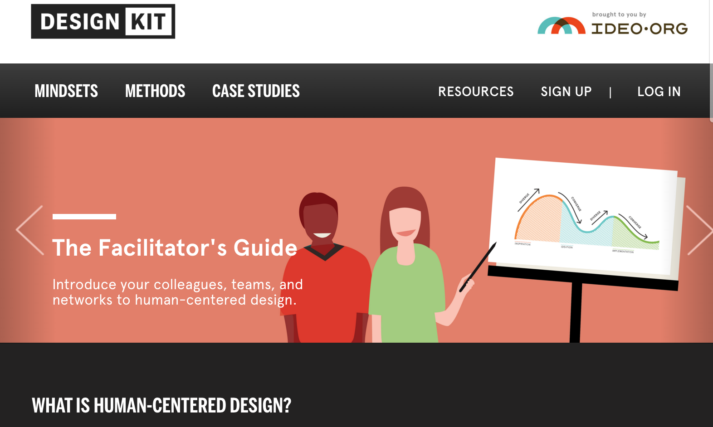](http://www.designkit.org/)

---

class:center,middle
# Does this sound like government as we know it?

---

class:center

## Of course not
---

# Why not?

[Source](http://www.telegraph.co.uk/news/picturegalleries/worldnews/4223984/My-Way-by-George-W-Bush.html?image=3)

---

> ### We hold these truths to be self-evident, that all men are created equal, that they are endowed by their Creator with certain unalienable Rights, that among these are Life, Liberty and the pursuit of Happiness.--That to secure these rights, Governments are instituted among Men, deriving their just powers from the consent of the governed.

+ US Declaration of Indepdence

---

> ### We the People of the United States, in Order to form a more perfect Union, establish Justice, insure domestic Tranquility, provide for the common defence, promote the general Welfare, and secure the Blessings of Liberty to ourselves and our Posterity, do ordain and establish this Constitution for the United States of America.

+ US Constitution

---

class:middle

> Government of the people, by the people, for the people

- Gettysburg Address

---

# Why Not?

--

+ Government is meant to serve the interests of the people
--

+ There is no better way to serve the complex needs of governing
--

+ It just works
--

---

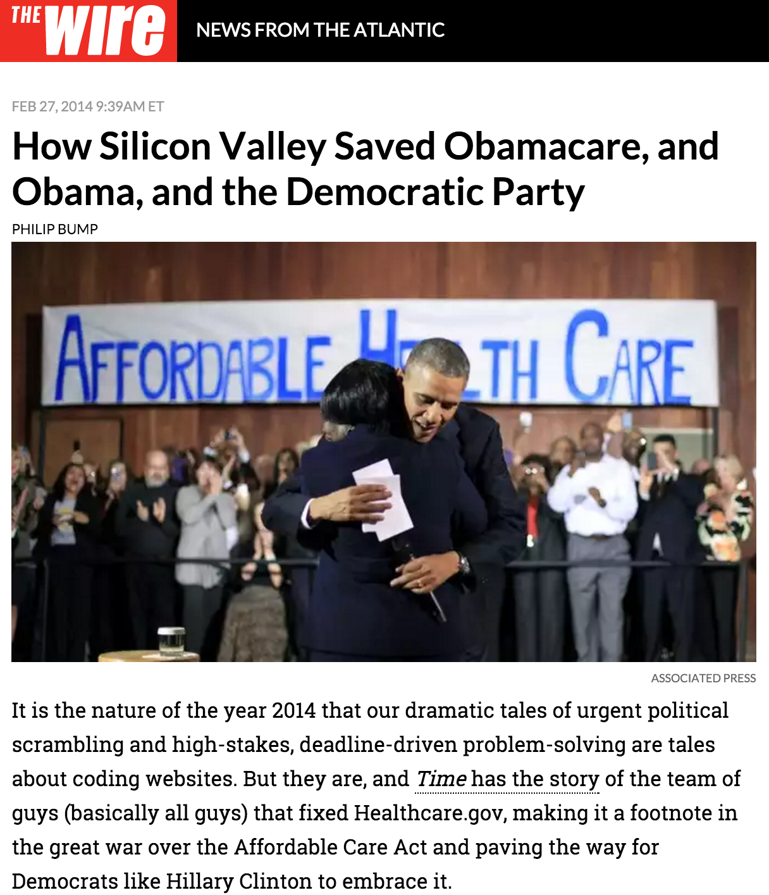
####[Source](http://www.thewire.com/politics/2014/02/how-silicon-valley-saved-obamacare-and-obama-and-democratic-party/358593/)
---

####[Source](http://www.newyorker.com/tech/elements/dont-go-chasing-waterfalls-a-more-agile-healthcare-gov)

---

# So what do I do?

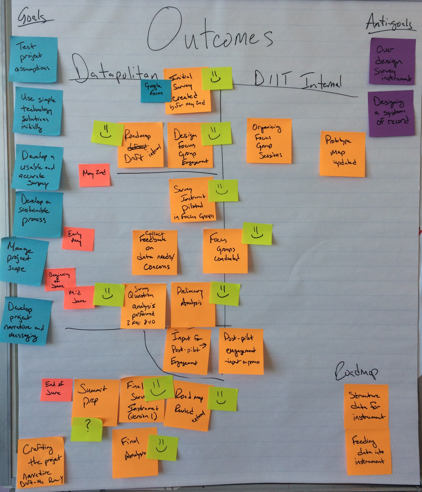
---

# So what do I do?

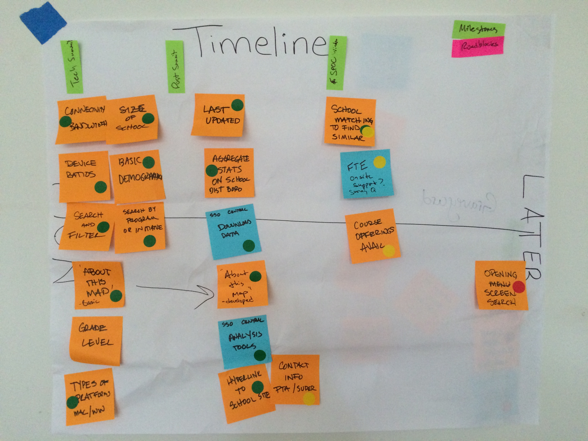
---

# So what do I do?

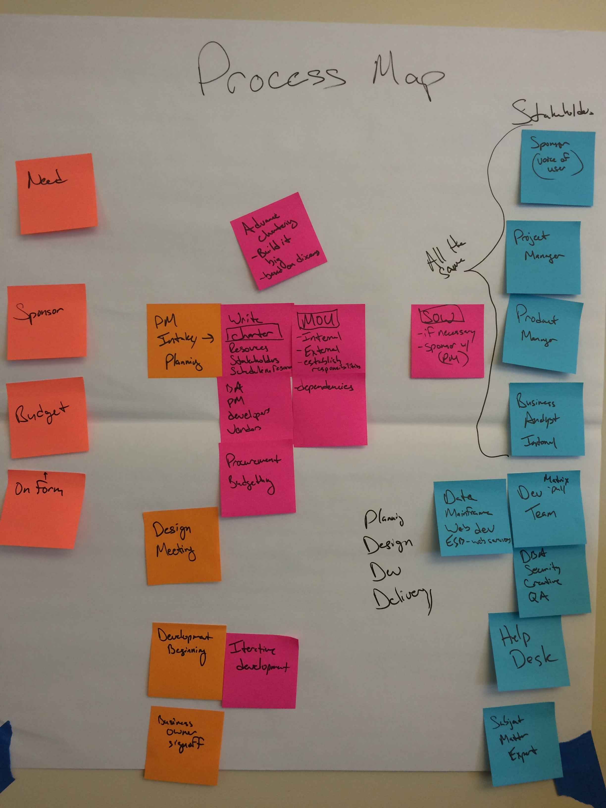

---

# How do I do it?
[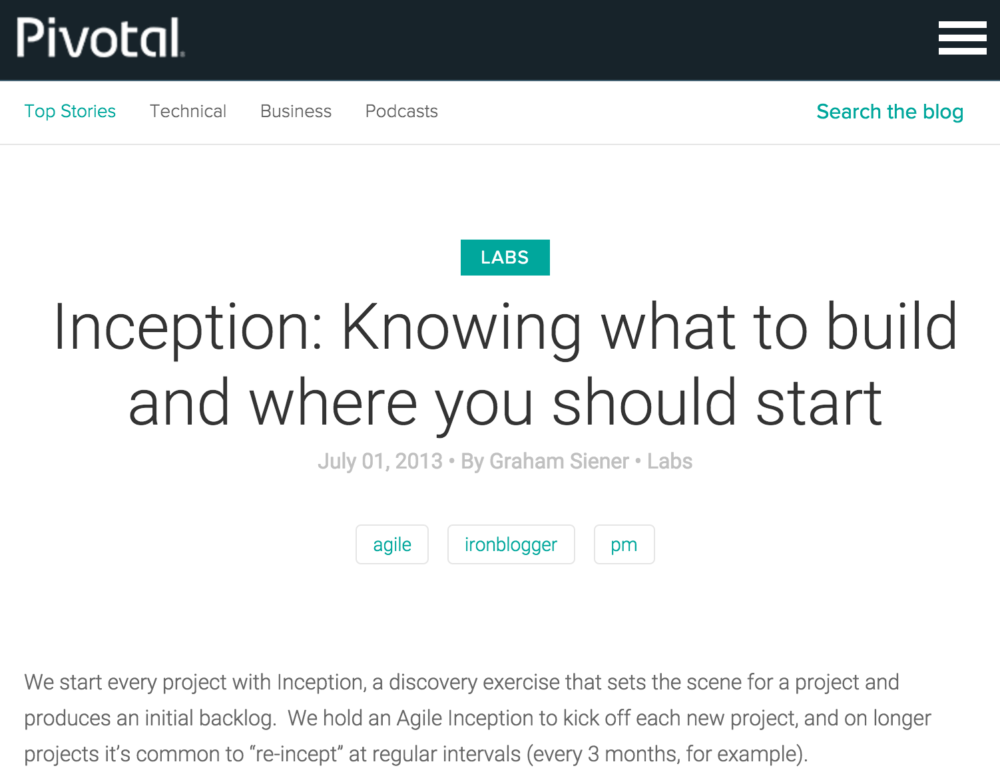](https://blog.pivotal.io/labs/labs/agile-inception_knowing-what-to-build-and-where-to-start)
[Source](https://blog.pivotal.io/labs/labs/agile-inception_knowing-what-to-build-and-where-to-start)

---

# Inception
--

+ Goals
--

+ Antigoals
--

+ Risks/Challenges
--

+ Personas, Roles, Activities
--

+ User Stories
--

+ Estimation
--

+ Prioritization

---

class:center,middle
[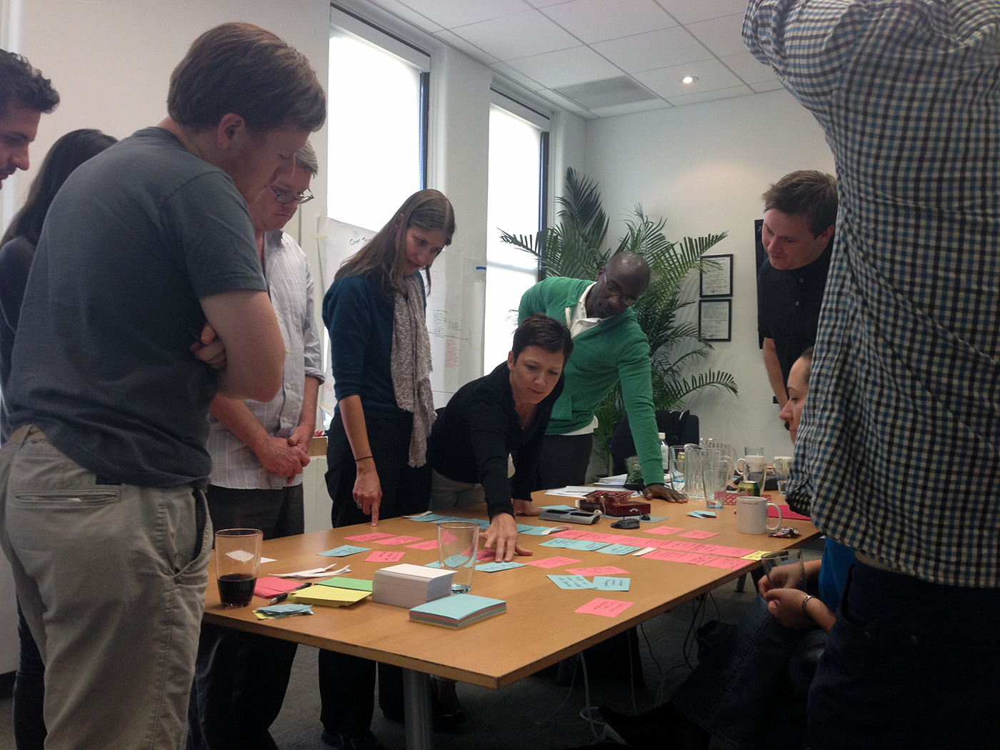](https://blog.pivotal.io/labs/labs/agile-inception_knowing-what-to-build-and-where-to-start)

---

class:center,middle
# But I'm not the first to do this in government
#&nbsp;
---

class:center,middle
# But I'm not the first to do this in government
# I can't even say I'm the best at it
---

class:center,middle
[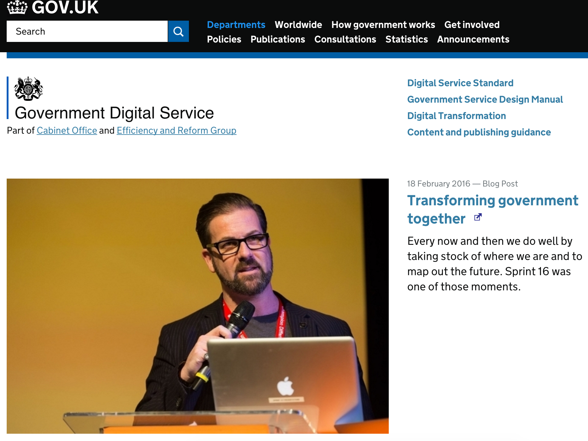](https://www.gov.uk/government/organisations/government-digital-service)

---

class:center,middle
[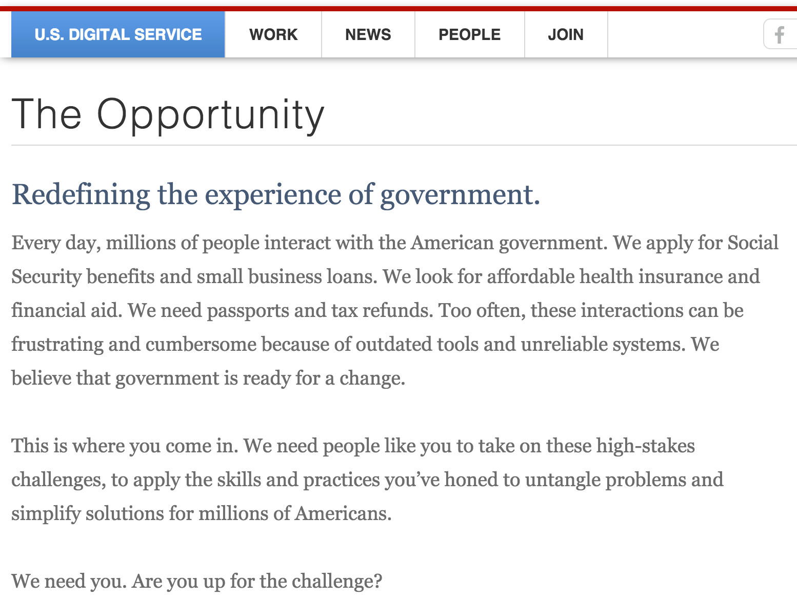](https://www.whitehouse.gov/digital/united-states-digital-service)

---

class:center,middle

---

class:center,middle
# Successes

---
class: center,middle
[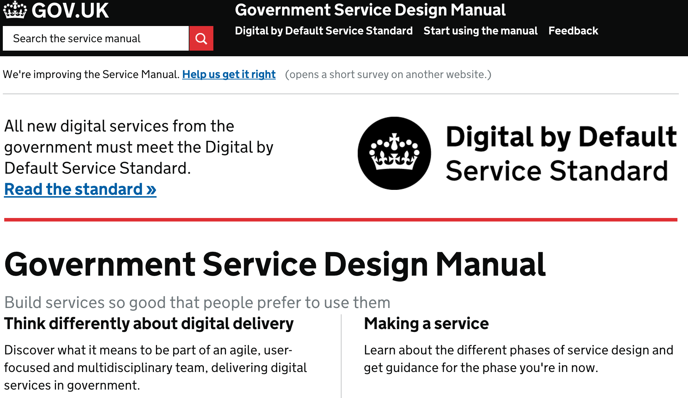](https://www.gov.uk/service-manual)

---

class:center,middle

---

class:center,middle

---

class:center,middle
[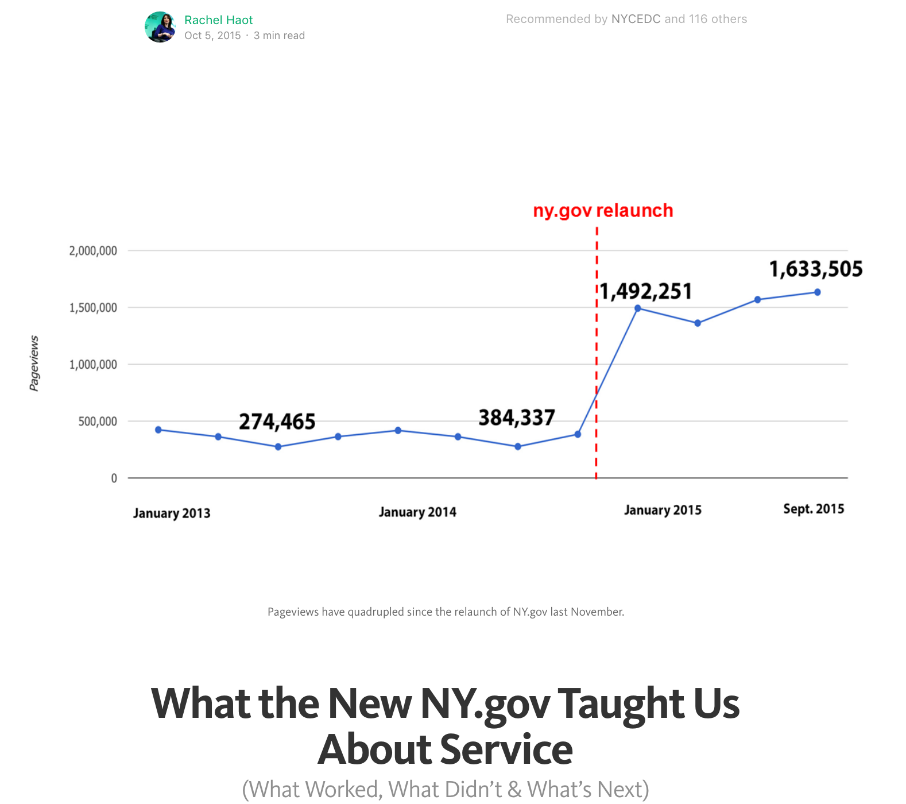](https://medium.com/@rachelhaot/what-ny-gov-taught-us-about-service-design-284e507a2e75#.katq6lsi1)

---

class:center,middle
# It doesn't always work like we hope

---

class:center,middle

[Source](https://www.civilserviceworld.com/articles/news/government-digital-service-%E2%80%9Chindered-delivery%E2%80%9D-rural-payments-programme-public)

---

class:center,middle
# But at the end of the day...

---

class:center,middle

---

class:middle
> Government of the people, by the people, for the people

---

# Thank You
+ [richard@datapolitan.com](mailto:richard@datapolitan.com)
+ http://blog.datapolitan.com
+ [@rdunks1](https://twitter.com/rdunks1)/[@datapolitan](https://twitter.com/Datapolitan)

---
# Questions?

